# Contenuti del sito personale — TEMPLATE DI ESEMPIO

> **Nota d'uso**: questo file contiene tutto il testo necessario per il sito personale di un ipotetico studente del 5° anno dell'IIS Marconi Pieralisi di Jesi, indirizzo Informatica e Telecomunicazioni. I dati sono **inventati**: ogni studente deve sostituirli con i propri (nome, foto, esperienze, progetti, premi, ecc.) mantenendo la stessa struttura. I segnaposto del tipo `[DA PERSONALIZZARE]` indicano i punti in cui inserire le proprie informazioni reali.

---

## 0. DATI ANAGRAFICI E IDENTITÀ

- **Nome e Cognome**: Tommaso Rotoloni
- **Età**: 19 anni
- **Residenza**: Morro d'alba (AN)
- **Scuola**: IIS "Marconi Pieralisi" di Jesi
- **Indirizzo**: Informatica e Telecomunicazioni — articolazione Informatica
- **Classe**: 5ª CM — Anno scolastico 2025/2026
- **Email**: tommyroto4@gmail.com
- **Instagram**: tommy.roto
- **GitHub**: github.com/st10964-example

---

> **Nota importante per la pagina Home**: le sezioni 1, 2 e 3 vivono **sulla stessa pagina (`index.html`)** in scorrimento verticale. Sono state scritte come un unico racconto che si sviluppa naturalmente: prima un saluto breve, poi la presentazione personale e di studi, poi le passioni. Evita quindi qualsiasi "anticipo" tra una sezione e l'altra: ogni argomento viene introdotto una sola volta, nel momento in cui viene approfondito.

## 1. HOME — Hero di apertura

### Titolo della pagina
Tommaso Rotoloni

### Sottotitolo
Studente di Informatica — IIS "Marconi Pieralisi", Jesi

### Frase di benvenuto (1 riga sotto il sottotitolo)
Cinque anni di scuola, le cose che mi appassionano, qualche progetto: ecco quello che ho da raccontare.

### Pulsanti CTA dell'hero
- "Scopri di più" → ancora alla sezione "Chi sono" (`#chi-sono`)
- "Le mie materie" → link a `materie.html`

---

## 2. CHI SONO

# 2. CHI SONO E IL MIO PERCORSO

Ho 19 anni e vivo a Morro d'Alba. Sono una persona sempre in cerca di nuove sfide e nuove passioni; cerco di mantenere attiva la mia curiosità perché, d'altronde, è ciò che muove il mondo. Inoltre, cerco sempre di farmi trovare disponibile, aiutando chiunque ne abbia bisogno.

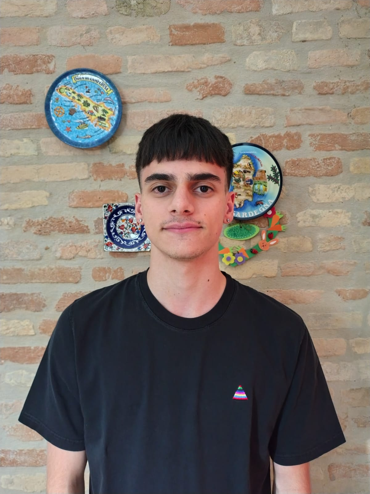

### Il mio bilancio critico (Oltre le righe del codice)
Ho scelto questa scuola spinto da una forte curiosità verso il mondo tech, un interesse nato fin da quando ero bambino, tanto che il computer è stato lo strumento con cui ho mosso i miei primi passi nell'apprendimento e nella scrittura. 

Nel corso degli anni, però, non sono state sempre rose e fiori. Ho affrontato difficoltà reali con la programmazione pura che mi hanno portato a una maturazione importante: capire che lo sviluppo software e la scrittura di codice non rappresentano realmente ciò che voglio in questo momento per il futuro. Non è però tutto da buttare: il marconi-pieralisi mi ha lasciato un bagaglio inestimabile, insegnandomi come pensare, la logica strutturata, la capacità di analizzare problemi complessi e una solida forma mentis tecnologica.

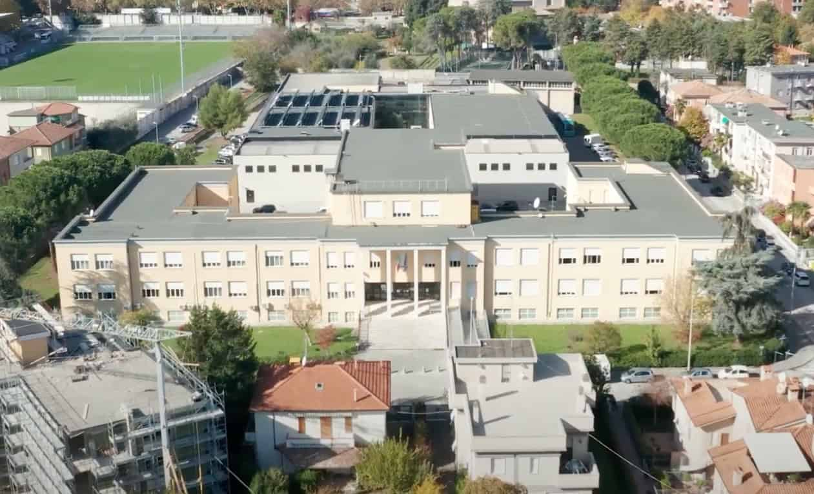

### Uno sguardo al futuro: Direzione Economia
Finita la maturità, di solito ci si ritrova difronte al vuoto, per la prima volta non ci sarà nessuno a dirti cosa fare, perciò ho cercato di anticipare questo inconvenevole, guardandomi intorno, prima con l'intenzione di trovare un'occupazione, successivamente ho cambiato idea, puntando ancora una volta sullo studio, infatti, ho deciso di intraprendere una strada nuova dove sfruttare la metodologia analitica della mia scuola: proseguirò gli studi iscrivendomi alla Facoltà di **Economia** presso l'**Università Politecnica delle Marche in Ancona. 

Sono convinto che l'unione tra la mentalità tecnica dell'ITIS e gli studi economici sia una combinazione vincente per capire i mercati moderni, dove la gestione dei Big Data, la digitalizzazione e l'analisi dei flussi finanziari e informativi sono ormai colonne portanti di ogni azienda.

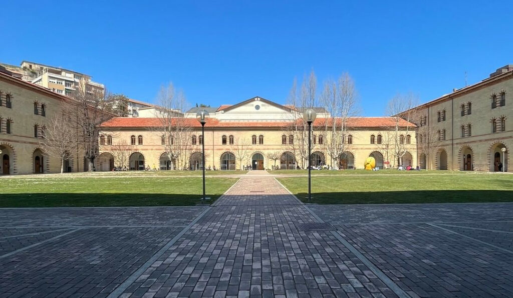

---

### Immagini suggerite
- `immagini/home-hero.jpg` — foto profilo dello studente (sostituibile)
- `immagini/scuola-marconi.jpg` — istituto Marconi Pieralisi
- `immagini/univpm-ancona.jpg` — Università Politecnica delle Marche

---

## 3. LE MIE PASSIONI

### Frase di passaggio (1 riga, fa da ponte con la sezione precedente)

Fuori dall'aula e dai laboratori, cerco sempre di mantenere il giusto equilibrio dedicandomi a ciò che mi emoziona, mi mette alla prova e mi permette di staccare la spina:

### 3.1 Musica
Durante la giornata ascolto spesso la musica, mi serve per intrattenermi mentre faccio altre attività, come gameplay, oppure attività fisica individuale, ad esempio durante la corsa. La ascolto anche nei momenti vuoti, dove non ho nulla da fare, ascolto diversi generi musicali, spesso distanti tra di loro, magari un giorno ascolto la musica dei giorni d'oggi, oppure una playlist degli anni '80/'90.

### 🏎️ Motorsport e Formula 1
I motori sono una altra mia grande passioni, seguo in particolare fin da piccolo la formula 1, seguendo saltuariamente anche le moto. Non mi limito a seguirli da casa: lo scorso anno ho passato una giornata di puro divertimento e passione all'Autodromo Enzo e Dino Ferrari di Imola, andando a veder correre la Formula 1. Sentire il rombo dei motori dal vivo e vedere questi mostri di ingegneria è qualcosa di stupefacente e unisce perfettamente la mia passione per le corse e la velocità.

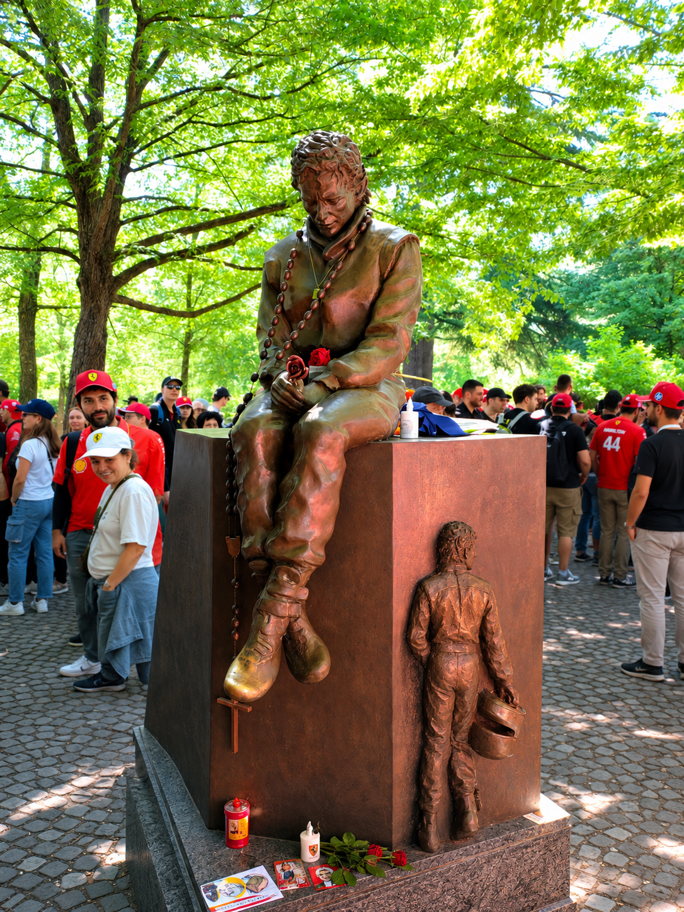

### ⚽ Il Calcio e lo Sport
Il calcio rappresenta la mia passione più grande, lo pratico sin da piccolo, fino all'età di 17 anni sono sempre stato legato alla squadra del mio paese, giocando con i miei amici dell'epoca, negli ultimi anni invece ho girato altre squadre della zona cercando di migliorare sempre di più, queste esperienze fuori dalla bolla del mio paesino mi hanno permesso di conoscere nuove persone e sviluppare fiducia in me stesso, ad oggi sono legato alla società sportiva Ostra calcio. Per me il calcio rappresenta un modo di sfogare tutte le pressioni e le difficoltà di tutti i giorni, appena entro all'interno del rettangolo verde, tutti i problemi svaniscono, mi sento più leggero e ciò mi permette di lavorare meglio con i miei compagni. Lavorare in sintonia con i compagni per raggiungere un obiettivo comune sul campo è una soft skill fondamentale che mi porto dietro anche nella vita di tutti i giorni.

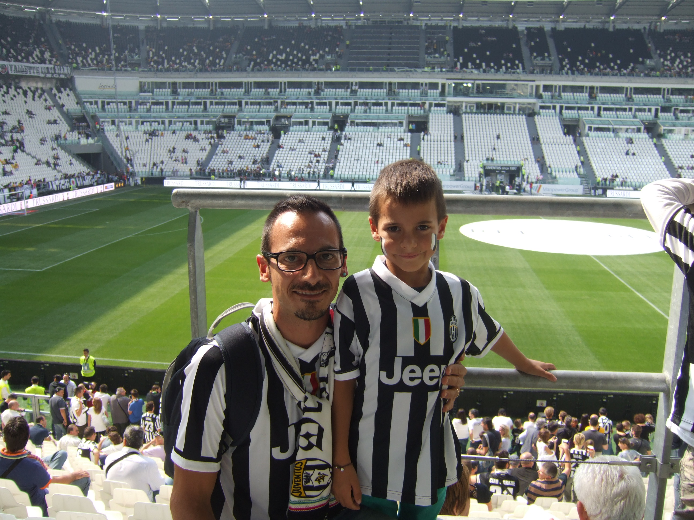

### Il Ping pong
Il ping pong è una passione più recente, l'ho scoperto durante l'estate del 2025, all'inizio ero una vera frana, ma con la stessa dedizione che dedico tutti giorni a scuola e calcio, sono migliorato molto, chissà se quest'estate sarà possibile fare qualche torno, misurandomi con persone sicuramente più esperte di me. 


### Immagini suggerite per le passioni
- `immagini/passione-motorsport.jpg`
- `immagini/passione-calcio.jpg`

---

## 4. MATERIE SCOLASTICHE

> Le materie del 5° anno dell'IIS Marconi Pieralisi sono organizzate in area scientifico-tecnica e area umanistica.

### AREA SCIENTIFICA / TECNICA

### 💻 Informatica (Materia d'Esame - Approfondita)

L'Informatica è la materia principale del nostro indirizzo e quest'anno ci ha permesso di lavorare insieme come in una vera azienda tecnologica. Il lavoro più importante che abbiamo fatto in classe è stato lo sviluppo di **Scout Admin**, un'applicazione web gestionale nata per digitalizzare e organizzare tutte le attività, i documenti e i dati logistici di un gruppo Scout.

Dal punto di vista tecnico, abbiamo progettato la piattaforma dividendo la logica in due parti, secondo il modello Client-Server. Per lo scambio dei dati abbiamo utilizzato i **Webservice REST** che comunicano in formato JSON. Tutta la gestione del backend è stata scritta in **PHP**, mentre per salvare e organizzare le informazioni abbiamo strutturato un database relazionale con **MySQL**, imparando a scrivere query complesse e a gestire i vincoli per non perdere o duplicare i dati. Per non fare confusione lavorando in tanti sullo stesso codice, abbiamo usato Git e GitHub e seguito la metodologia **Agile (Scrum)** per dividerci il lavoro.

Il mio compito durante questo progetto è stato quello di collaborare con il mio team, occupandomi di svolgere le varie task che ci venivano assegnate passo dopo passo per completare la piattaforma. Questo lavoro di squadra mi è servito molto a capire le mie attitudini: ho capito che mettermi a scrivere codice per ore non è la mia strada per il futuro, ma mi è piaciuto tantissimo occuparmi dell'analisi dei problemi, dell'organizzazione dei compiti e della logica con cui si gestiscono i flussi di dati. Sono tutte capacità analitiche e di gestione che considero una base ottima per il mio futuro percorso all'università in Economia.

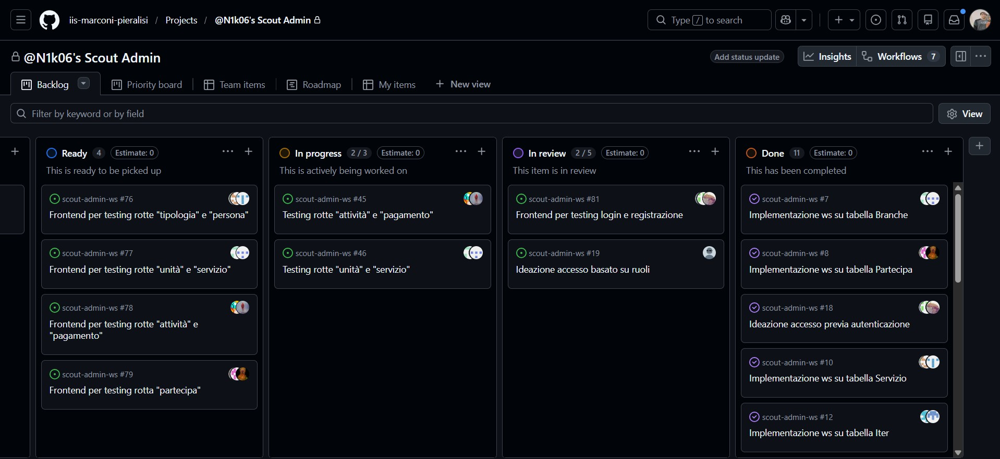

### 🌐 Sistemi e Reti

Sistemi e Reti è la materia dello scritto d'esame e quest'anno ci siamo concentrati tantissimo sulla Cybersecurity, in particolare su come si proteggono i dati che girano su internet. Il fulcro del programma è stato lo studio della **crittografia asimmetrica** (quella con la chiave pubblica e la chiave privata) e di come questa tecnologia venga usata per creare i **certificati digitali**, che sono una specie di carta d'identità elettronica per i siti web e i server.

Analizzando i documenti in classe, abbiamo studiato il ruolo fondamentale della **Certification Authority (CA)**. La CA è un ente terzo di fiducia che ha il compito di verificare l'identità di chi richiede un certificato e di "firmarlo" digitalmente per garantire a tutti che quel sito è sicuro e non è un imbroglio. Abbiamo visto come sono fatti questi certificati (seguendo lo standard X.509) e come contengano informazioni precise, come il nome del proprietario, la data di scadenza e, appunto, la chiave pubblica utilizzata per cifrare le comunicazioni.

Un altro argomento importantissimo che abbiamo affrontato è la **firma digitale**. Grazie a questo meccanismo, che si basa sull'uso combinato di funzioni di hash e crittografia, si riescono a garantire tre cose fondamentali: l'autenticità di chi manda il messaggio, l'integrità del testo (cioè la certezza che nessuno lo abbia modificato di nascosto durante il viaggio sulla rete) e il non ripudio. 

Dover applicare tutte queste nozioni di sicurezza e crittografia alla progettazione di reti complesse per le simulazioni d'esame è stato impegnativo, ma mi ha fatto capire quanto la protezione dei dati sia fondamentale oggi. Saper gestire e mettere in sicurezza le informazioni è una competenza strategica pazzesca, che si collega tantissimo alla mia scelta di studiare Economia all'università, dove la sicurezza dei dati aziendali, dei flussi finanziari e la trasparenza sono ormai alla base di qualsiasi attività sul mercato.

<section class="sezione-presentazione" style="margin-top: 40px; margin-bottom: 40px; text-align: center;">
  <h4 style="margin-bottom: 20px; font-family: sans-serif;">📄 La mia Presentazione Completa</h4>
  <iframe src="documenti/presentazione-certificati.pdf" width="100%" height="600px" style="border: 2px solid #ccc; border-radius: 8px; box-shadow: 0 4px 8px rgba(0,0,0,0.1);">
  </iframe>
</section>

### 💻 TPSIT 

In TPSIT quest'anno abbiamo studiato come funzionano le applicazioni web e come dialogano i dispositivi tra loro, usando come esempio pratico il sistema operativo **Android 9**. Abbiamo analizzato l'architettura **Client-Server**, cioè il modo in cui il nostro telefono (il Client) fa delle richieste a un server internet per ricevere i dati, sfruttando i protocolli HTTP e HTTPS.

La parte più interessante è stata vedere come Android 9 gestisce le risorse. Rispetto a un computer, uno smartphone deve stare attentissimo ai consumi: per questo il sistema blocca o limita le applicazioni in background, così da non sprecare la batteria e la memoria RAM. Abbiamo guardato anche il lato sicurezza, scoprendo che questa versione isola le app per evitare che si facciano danni a vicenda e obbliga l'uso di connessioni sicure e cifrate quando si scambiano dati sul web.

Capire cosa c'è dietro a un sistema operativo come Android mi ha fatto apprezzare l'importanza dell'organizzazione e dell'efficienza. Anche se all'inizio la teoria sembrava complicata, mi è piaciuto molto vedere come si ottimizzano le risorse, un concetto di gestione che mi tornerà sicuramente utile nei miei futuri studi di Economia.

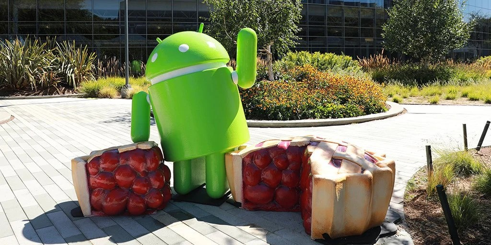

### 📊 GPOI (Gestione Progetto e Organizzazione d'Impresa)

GPOI è stata una materia utilissima perché ha fatto un po' da ponte tra il mondo tecnico dell'informatica e quello delle aziende. Quest'anno abbiamo studiato come si organizza e si pianifica un progetto reale dall'inizio alla fine. Abbiamo visto come si calcolano i tempi di consegna usando strumenti pratici come il diagramma di Gantt, come si fa un'analisi dei costi per capire se un investimento conviene (il ROI) e abbiamo approfondito le regole fondamentali sulla sicurezza sul lavoro (il D.Lgs. 81/08). 

La parte che mi è piaciuta di più è stata lo studio dei diversi modelli organizzativi delle imprese, cioè come sono strutturate le aziende e come si dividono le responsabilità i vari settori. Per me è stato un primo vero assaggio di quello che andrò a fare l'anno prossimo, visto che questi argomenti si collegano perfettamente con il percorso di Economia che ho scelto per l'università.

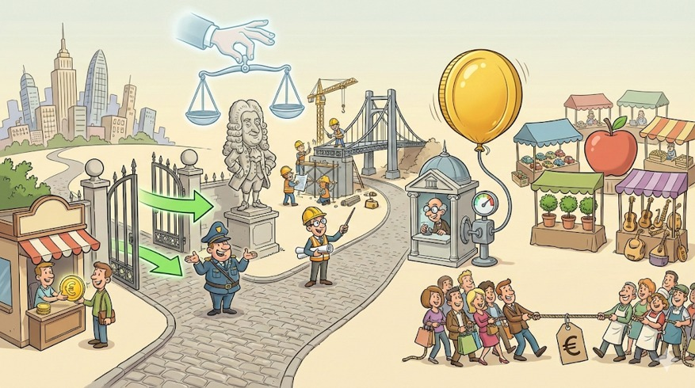

### 📐 Matematica

Il programma di matematica del quinto anno si è concentrato quasi interamente sull'analisi, in particolare sullo studio di funzione, i limiti, le derivate e gli integrali. Non si è trattato solo di fare calcoli meccanici alla lavagna, ma di capire come questi strumenti permettano di analizzare l'andamento di un fenomeno nel tempo e di prevederne i risultati.

Nonostante le difficoltà oggettive che la materia comporta, ne ho apprezzato molto il valore logico. Saper leggere un grafico, analizzare una funzione e interpretare i dati sono competenze fondamentali che mi hanno allenato la mente a ragionare in modo strutturato. È un tipo di approccio analitico che mi tornerà utilissimo l'anno prossimo all'università, dato che l'Economia si basa proprio su modelli matematici e statistici per comprendere l'andamento dei mercati e delle aziende.

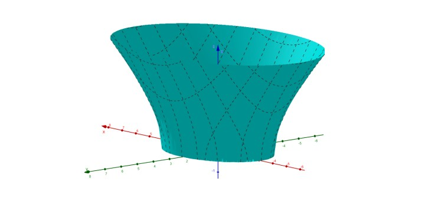

### 🤖 Intelligenza Artificiale

L'Intelligenza Artificiale è stata la materia di curvatura del nostro istituto e quest'anno l'abbiamo studiata con un approccio molto pratico. Abbiamo visto come si è evoluta l'IA nel tempo, partendo dai vecchi sistemi esperti fino ad arrivare ai modelli moderni di Machine Learning e Deep Learning, che sono quelli che permettono ai computer di imparare dai dati senza essere programmati da zero.

Durante le lezioni abbiamo fatto anche degli esperimenti pratici usando Python e alcune librerie specifiche come Scikit-learn per capire come funzionano gli algoritmi predittivi. È stato incredibile vedere come, dando in pasto a una macchina una marea di informazioni, questa riesca a trovare dei collegamenti e a fare previsioni sul futuro. Questo modo di analizzare i dati mi affascina molto e sono sicuro che mi servirà tantissimo a Economia, dato che oggi l'IA viene usata sempre di più per prevedere l'andamento dei mercati e per aiutare le aziende a prendere decisioni strategiche.


### AREA UMANISTICA

### 🇮🇹 Lingua e Letteratura Italiana 

Quest'anno in letteratura abbiamo affrontato il periodo tra la fine dell'Ottocento e l'inizio del Novecento. È stato un percorso affascinante perché il tema centrale di tutti gli autori è la crisi dell'uomo moderno, la perdita delle certezze e il fatto che non ci si sente più sicuri di niente, un po' come succede spesso a noi ragazzi oggi.

L'autore che mi ha colpito di più in assoluto è **Luigi Pirandello**. Con il suo concetto di "relativismo", Pirandello spiega che non esiste una sola verità, ma ognuno ha la sua. La cosa più bella che abbiamo studiato è la teoria della "maschera": secondo lui, noi non siamo una persona sola, ma indossiamo tante maschere diverse a seconda di quello che la società, la famiglia o la scuola si aspettano da noi. Questo ti porta a non capire più chi sei veramente, creando una crisi d'identità pazzesca, come succede nel romanzo *Il fu Mattia Pascal*, dove il protagonista prova a cambiare vita e a inventarsi un'altra identità, ma alla fine si ritrova a non essere nessuno.

Subito dopo abbiamo studiato **Italo Svevo** e il suo romanzo più famoso, *La coscienza di Zeno*. Svevo introduce la figura dell'**Inetto**, cioè una persona che sembra bloccata, incapace di vivere e di combinare qualcosa di buono, che rimanda sempre le decisioni importanti (basti pensare all'ossessione di Zeno per l'ultima sigaretta). A scuola però abbiamo fatto una riflessione diversa: l'inetto non è semplicemente un fallito, ma è uno che si analizza tantissimo, che si guarda dentro con un'onestà spietata. 

Questa figura dell'inetto e l'idea delle maschere di Pirandello mi hanno fatto riflettere molto sul mio percorso. Anche io, ad un certo punto, ho dovuto guardarmi dentro con la stessa onestà di Zeno. Ho capito che la maschera del programmatore informatico puro che stavo indossando a scuola non mi apparteneva, e ho avuto la forza di ammettere a me stesso che quella non era la mia strada. Questa autoanalisi critica mi ha dato la spinta per cambiare rotta e scegliere con convinzione il mio futuro percorso all'università in Economia.

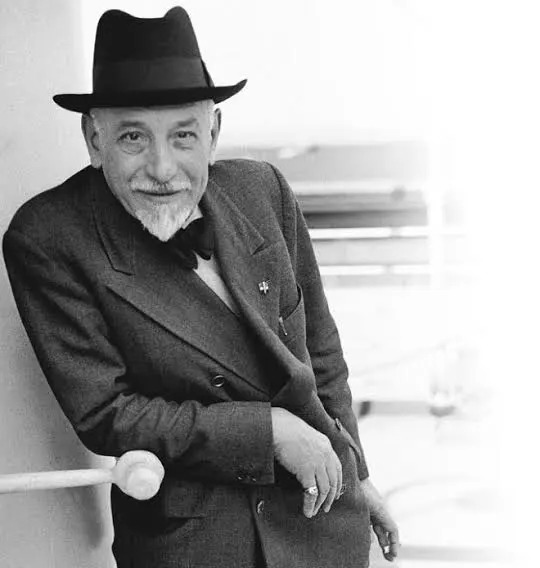

### 📜 Storia

In storia il programma dell'ultimo anno è stato intenso, ma la parte che mi è piaciuta di più in assoluto è stata la ricerca di gruppo sulle **prime votazioni delle donne in Italia tra il 1945 e il 1946**. È stato un momento cruciale, in cui il Paese doveva rimettersi in piedi dopo il disastro della guerra e del fascismo.

Analizzando i documenti dell'epoca, in particolare le testimonianze della giornalista Anna Garofalo, abbiamo scoperto quanto fosse forte l'emozione di quei giorni. Le donne ricevevano le schede a casa e le custodivano come tesori preziosi. C'era un'immagine bellissima nella nostra ricerca che paragonava l'Italia di allora a una "casa in rovina" che le donne, con il voto, avevano finalmente il diritto e il dovere di ripulire e ricostruire da zero.

Vedere le foto storiche di quelle lunghe file ai seggi mi ha fatto riflettere. Per noi oggi votare sembra una cosa scontata, ma studiare questo percorso mi ha fatto capire che la libertà è stata conquistata con i sacrifici di chi è venuto prima. È stata una lezione fondamentale per sviluppare una coscienza critica, che mi servirà sicuramente anche per comprendere le dinamiche sociali nel mio futuro percorso in Economia.

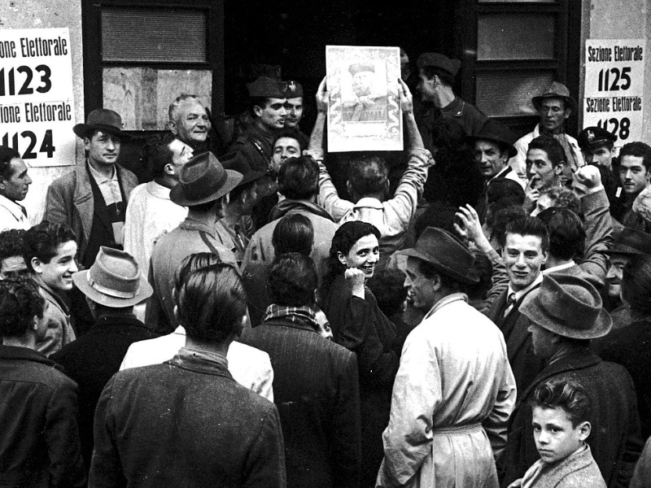

### 🇬🇧 Lingua Inglese

In inglese quest'anno abbiamo studiato la letteratura dell'età vittoriana, concentrandoci soprattutto su **Charles Dickens**. Rispetto ad altri autori del periodo, come Oscar Wilde che inseguiva l'ideale dell'Estetismo e del "bello fine a se stesso", l'obiettivo di Dickens era completamente opposto: lui usava la scrittura come un'arma di denuncia sociale per mostrare la realtà nuda e cruda del suo tempo.

Il punto centrale del nostro percorso è stato lo studio di ***Oliver Twist***. Attraverso la storia di questo orfano, l'obiettivo principale dell'autore era quello di svelare l'ipocrisia della società vittoriana, criticando duramente il sistema delle *workhouses* e lo sfruttamento dei bambini. Mentre Wilde si concentrava sull'apparenza e sull'arte, Dickens voleva scuotere le coscienze dei lettori, descrivendo la miseria, la povertà e gli effetti più spietati della Rivoluzione Industriale.

Trovo che questa differenza sia affascinante ed estremamente moderna. L'obiettivo di Dickens mi ha fatto riflettere su come l'economia e lo sviluppo industriale non debbano essere visti solo come numeri, produzione o freddo profitto, ma debbano sempre mettere al centro il benessere delle persone. È una lezione di grandissima attualità che mi porterò sicuramente dietro l'anno prossimo all'università nel mio percorso in Economia.

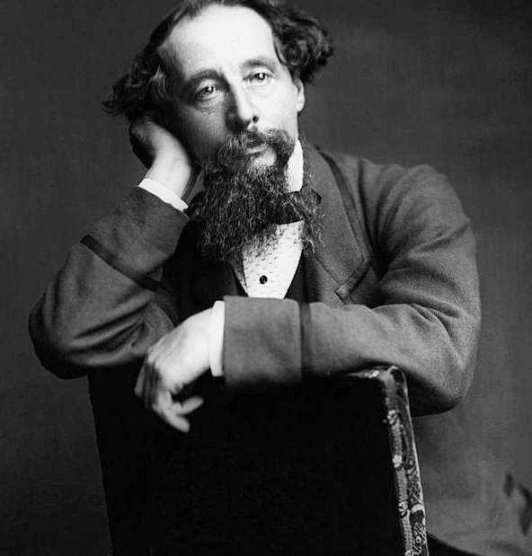

### ALTRO

### 🏃‍♂️ Scienze Motorie

In Scienze Motorie il percorso di quest'anno si è concentrato sull'importanza dello sport non solo per il benessere fisico, ma anche come strumento di inclusione e di crescita personale. Abbiamo approfondito i benefici dell'attività motoria regolare sulla salute, studiando come il movimento aiuti a prevenire lo stress e a migliorare la concentrazione, due elementi fondamentali durante l'anno della maturità.

Oltre alla parte pratica in palestra, abbiamo affrontato temi legati al fair play, al rispetto delle regole e al valore del gioco di squadra. Collaborare con i compagni per raggiungere un obiettivo comune, accettando le sconfitte e superando i propri limiti, è stata una bella palestra di vita. È un'attitudine al lavoro di gruppo e al rispetto reciproco che considero fondamentale per il mio futuro, sia all'università che nel mondo del lavoro.

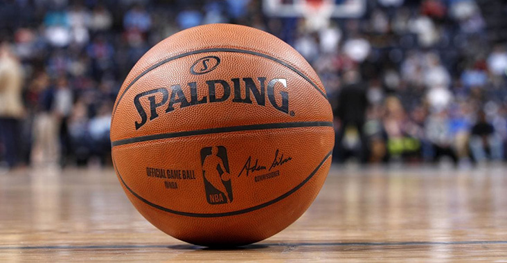

---

# 6. EDUCAZIONE CIVICA: LEGALITÀ, DIRITTI E CITTADINANZA

### Il nostro percorso oltre i banchi di scuola

Il percorso di Educazione Civica di quest'anno è stato una vera e propria finestra sul mondo reale. Spesso si pensa alla cittadinanza o alla legalità come a concetti astratti da studiare sui libri, ma le attività che abbiamo fatto ci hanno dimostrato il contrario. Abbiamo affrontato due grandi temi che toccano da vicino la nostra vita di tutti i giorni e il nostro futuro: da un lato il funzionamento della giustizia e la tutela dei diritti dei cittadini, dall'altro il potere dell'informazione e i rischi legati alla propaganda e alla manipolazione mediatica.

### A tu per tu con la giustizia: l'esperienza delle Camere Penali

L'esperienza più forte ed emozionante è stata sicuramente il progetto legato alle Camere Penali, che ci ha portato a vivere da vicino il mondo della giustizia. Non si è trattato solo di una lezione teorica: abbiamo avuto l'opportunità di andare al Palazzo di Giustizia di Ancona per assistere a vere udienze e a processi penali e civili reali. Vedere dal vivo la dinamica dell'aula, con il Giudice, il Pubblico Ministero e gli Avvocati difensori, ci ha fatto capire come funziona la macchina giudiziaria e quanto sia fondamentale il rispetto delle regole per garantire a chiunque un giusto processo.

Il momento più interessante, però, è stato quando ci siamo messi in gioco in prima persona. Abbiamo partecipato a una vera e propria simulazione di un processo penale, dove ognuno di noi ha interpretato un ruolo: chi i giudici, chi gli avvocati, chi i testimoni. Trovarci dentro quelle dinamiche ci ha costretto a ragionare sul valore delle prove, sulla responsabilità delle parole e, soprattutto, sul principio costituzionale della presunzione di innocenza. È stato un esercizio incredibile di empatia e di logica, che ci ha fatto capire quanto sia delicato e importante il compito di giudicare o difendere qualcuno.

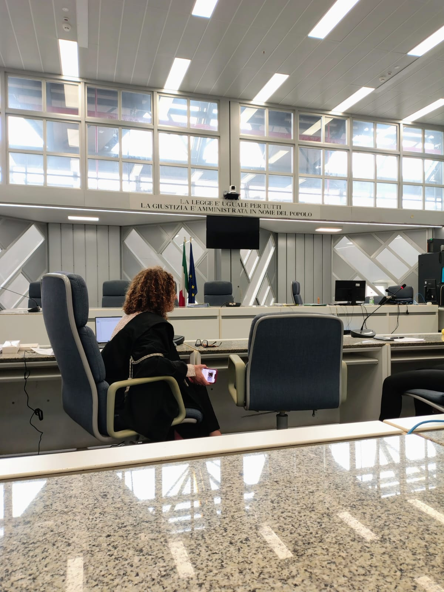

### Informazione e potere: il peso della propaganda

Il secondo pilastro del nostro percorso ha riguardato un tema caldissimo per la nostra generazione: la propaganda e la manipolazione dell'informazione. Viviamo immersi nei social e bombardati da notizie ogni secondo, ma raramente ci fermiamo a riflettere su *come* queste notizie vengano costruite e veicolate. Durante l'anno abbiamo analizzato i meccanismi con cui la propaganda e le fake news riescono a orientare l'opinione pubblica, facendo leva sulle emozioni, sulle paure e sui pregiudizi delle persone.

Abbiamo capito che la manipolazione non è un fenomeno nato con internet — basti pensare alla propaganda dei totalitarismi del Novecento studiata in storia — ma che le tecnologie digitali e gli algoritmi di oggi l'hanno resa infinitamente più pervasiva e veloce. Riconoscere un contenuto manipolato o un "deep fake" richiede uno sforzo continuo, uno spirito critico che va allenato ogni giorno verificando le fonti e non fermandosi ai titoli acchiappa-clic.

Tutti questi rischi legati alla rete si collegano strettamente anche a quanto abbiamo affrontato nel programma di **GPOI**. Studiando l'organizzazione aziendale e la gestione dei dati, abbiamo infatti approfondito l'importanza della **privacy online** e della protezione delle informazioni personali. Capire come funzionano le normative e conoscere il ruolo del **Garante della Privacy** ci ha fatto rendere conto che la tutela dei nostri dati non è solo un obbligo burocratico per le imprese, ma un diritto fondamentale per noi cittadini per difenderci da usi distorti e manipolatori della tecnologia.


---

Ecco l'intera sezione strutturata in **Markdown**, con i titoli corretti e i percorsi delle immagini inseriti tra i vari blocchi come concordato:

```markdown
# 7. FORMAZIONE E SCUOLA LAVORO (FSL / ex PCTO)

### Il Progetto "Tecnici per un giorno"

Durante il quarto anno ho affrontato l'esperienza di Formazione e Scuola Lavoro (ex PCTO) con un progetto intitolato "Tecnici per un giorno". La cosa bella è stata poterlo fare insieme a un mio compagno di classe. Curioso il luogo dove si è svolta l’attività: quando si pensa all’ITIS Informatica ci si immagina le aziende alla ricerca dei ragazzi, invece siamo stati mandati alla scuola media "Carlo Lorenzini" di Jesi.

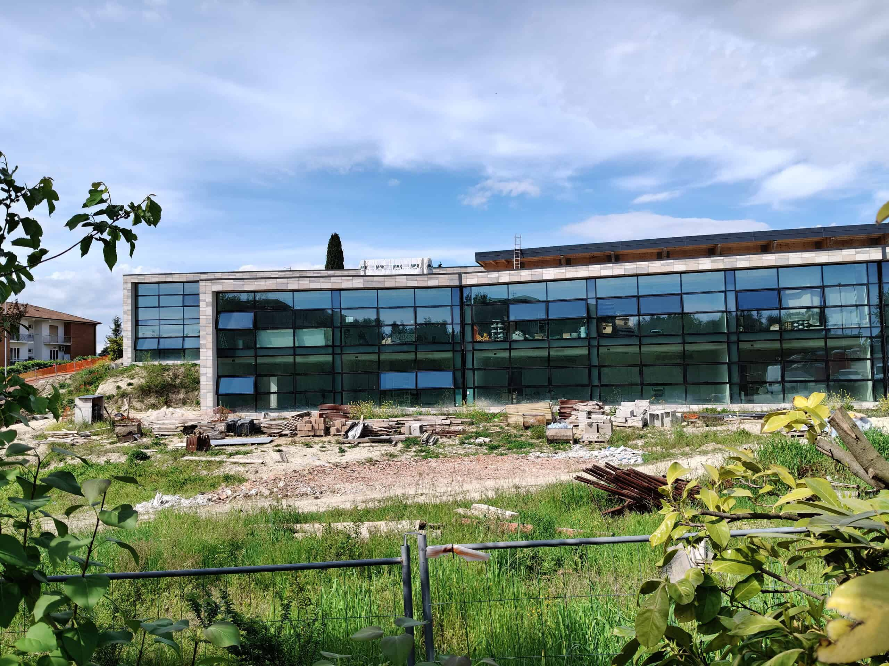

Fin dal primo giorno non ci siamo trovati davanti a compiti teorici o simulazioni, ma a una situazione vera, caotica e stimolante. L'obiettivo era rimettere in sesto, gestire e far funzionare il laboratorio di informatica che professori e ragazzi delle medie usano tutti i giorni. È stata un'occasione unica per prendere le cose studiate sui libri all'ITIS e vedere l'effetto che fanno quando le applichi sul campo, ma soprattutto ci ha insegnato tantissimo sul piano dei rapporti umani, molto oltre i programmi scolastici.

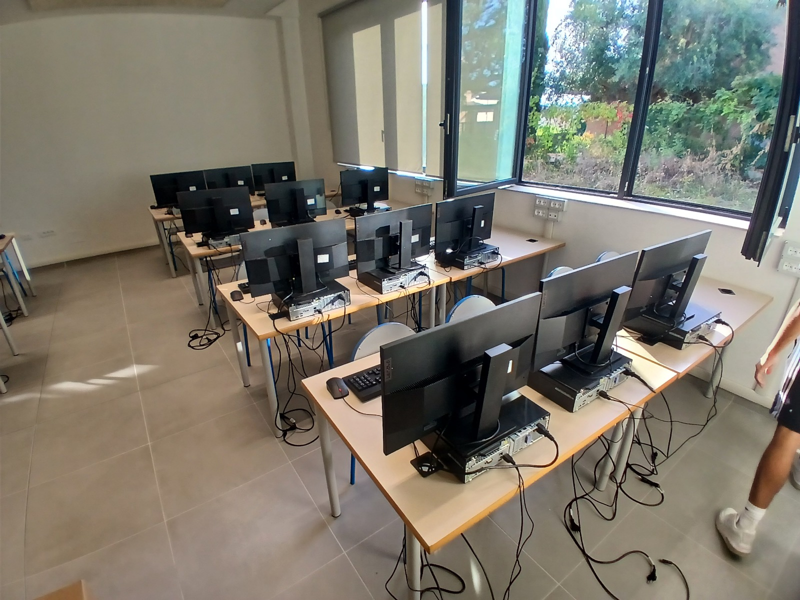

### Le Soft Skills sviluppate: la crescita personale e il valore dell'esperienza

Fondere la teoria con la pratica ci ha costretto a crescere tantissimo, soprattutto a livello umano. Se devo pensare alla competenza trasversale più importante che mi sono portato a casa, è senza dubbio la comunicazione efficace. Lavorare in una scuola media mi ha insegnato l'importanza di saper parlare con utenti non tecnici. Spiegare un problema di rete o il funzionamento di un software a un professore in difficoltà o a un ragazzo delle medie ti costringe a eliminare il gergo difficile e a tradurre concetti complessi in un linguaggio semplice, chiaro e accessibile a chiunque.

Oltre alla comunicazione, l'esperienza ha testato la mia autonomia. Spesso dovevamo gestire le attività da soli, prendendo l'iniziativa per risolvere i guasti improvvisi senza una supervisione costante. E poi c'è stato il valore del lavoro in team con Francesco: collaborare strettamente, dividerci i compiti e supportarci nei momenti in cui le richieste di assistenza si accumulavano ci ha insegnato cosa significa la responsabilità condivisa e il rispetto delle scadenze.

In conclusione, questa esperienza è stata preziosa perché mi ha fatto testare fuori dall'aula quanto possano essere utili le mie qualità in un contesto lavorativo reale. Mi ha dato un metodo: la capacità di applicare la logica analitica dell'informatica non solo alle macchine, ma anche alle relazioni umane.

### Consapevolezza digitale: le nostre guide per la scuola

Oltre alla manutenzione tecnica, un'attività centrale del nostro percorso è stata la creazione di vere e proprie guide informative destinate agli studenti e al personale delle medie, per promuovere un utilizzo consapevole di Internet e degli strumenti informatici.

In queste guide abbiamo affrontato temi pratici ma fondamentali per la sicurezza quotidiana. Abbiamo spiegato l'importanza di organizzare correttamente i propri file all'interno dello spazio Cloud di Google, ma soprattutto abbiamo insistito sulle buone pratiche di cybersecurity a livello personale, come l'obbligo di disconnettere sempre il proprio account Google quando si utilizzano computer in comune. Nelle scuole medie, infatti, i PC del laboratorio vengono scambiati continuamente tra classi diverse: lasciare una sessione aperta significa esporre i propri dati personali, le email e i documenti a chiunque, rischiando violazioni della privacy. Questa attività mi ha fatto capire quanto le competenze informatiche debbano sempre tradursi in responsabilità e divulgazione etica.

---

## 7. CONTATTI

- **Email**: tommyroto4@gmail.com
- **Instagram**: tommy.roto
- **GitHub**: github.com/st10964-example

---

## 8. NOTE DI STILE E TONO PER LA SCRITTURA

> Da ricordare quando si personalizzano i contenuti per il proprio sito personale.

- **Tono**: caldo ma misurato, mai eccessivamente informale. Lo studente racconta sé stesso a un pubblico ampio (commissione d'esame, futuri datori di lavoro, conoscenti).
- **Persona**: prima persona singolare ("Io credo che...", "Durante il quinto anno ho avuto modo di...").
- **Lunghezza dei paragrafi**: medi (4-7 righe). Evitare frasi troppo brevi e telegrafiche, ma anche periodi infiniti.
- **Tecnicismi**: usarli quando servono (è una scuola tecnica), ma sempre con un breve chiarimento.
- **Coerenza**: la persona descritta in "Chi sono" deve essere coerente con le passioni, con le scelte fatte nel percorso e con quanto raccontato del PCTO.
- **Aggiornamento**: ogni studente sostituisce nomi, date, aziende, premi, foto e dettagli personali con i propri.

---

## 9. APPENDICE — Mappa delle immagini disponibili

> Nella cartella `immagini/` ci sono **25 immagini** già pronte (royalty-free, scaricate da LoremFlickr). Usa esattamente questi nomi file quando inserisci i tag `` nelle pagine HTML. Tutte le immagini hanno una risoluzione di 1200×800 px.

### Profilo e scuola
- `immagini/home-hero.jpg` — immagine di hero per la pagina principale
- `immagini/scuola-marconi.jpg` — istituto Marconi Pieralisi
- `immagini/univpm-ancona.jpg` — Università Politecnica delle Marche (per "sguardo al futuro")

### Passioni
- `immagini/passione-motorsport.jpg`
- `immagini/passione-calcio.jpg`

### Materie — area scientifica/tecnica
- `immagini/nuova-informatica.jpg`
- `immagini/materia-tpsit.jpg`
- `immagini/materia-gpoi.jpg`
- `immagini/materia-matematica.jpg`
- `immagini/materia-intelligenza-artificiale.jpg` (Intelligenza Artificiale)

### Materie — area umanistica
- `immagini/materia-italiano.jpg`
- `immagini/materia-storia.jpg`
- `immagini/materia-inglese.jpg`

### Altre materie
- `immagini/materia-scienze-motorie.jpg`

### Educazione Civica
- `immagini/immagini/camera-penale.jpg` (sezione esperienza in Tribunale e Camere Penali)
- `immagini/edcivica-cittadinanza-digitale.jpg` (sezione cittadinanza Digitale e Privacy)

### FSL
- `immagini/scuola-lorenzini.jpg` (scuola)
- `immagini/laboratorio-lorenzini.jpg` (laboratorio)

### Nota su licenze
Le immagini sono fornite tramite LoremFlickr (Flickr Creative Commons). Vanno **sostituite con foto proprie o esplicitamente royalty-free** prima della pubblicazione definitiva del sito. Fonti consigliate per il sostituto: [Unsplash](https://unsplash.com), [Pexels](https://pexels.com), [Pixabay](https://pixabay.com).
